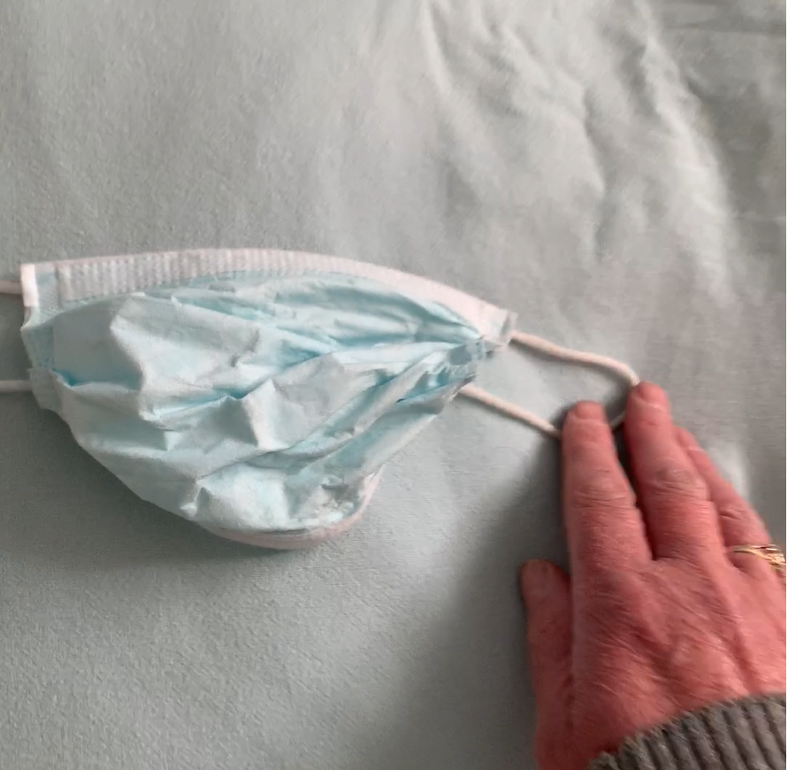
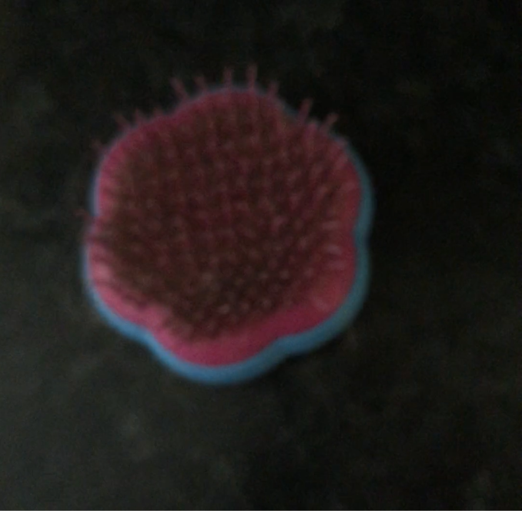
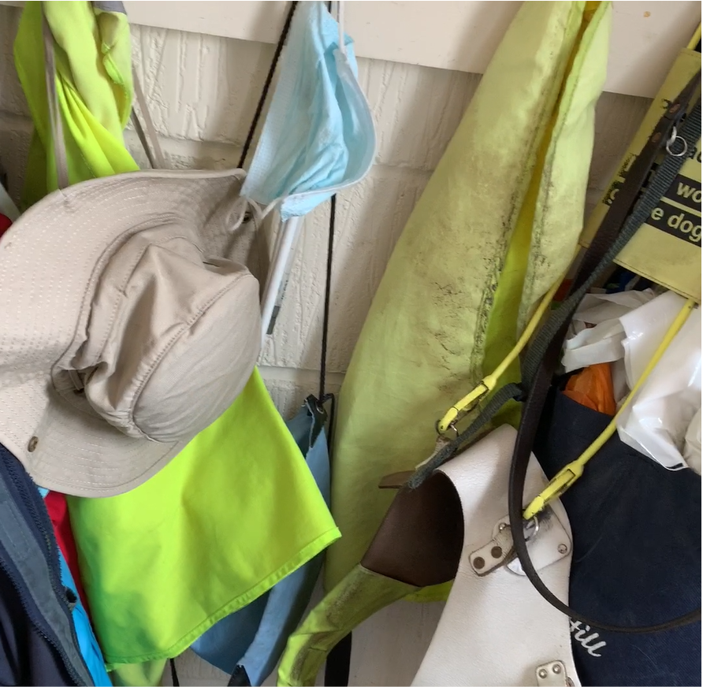
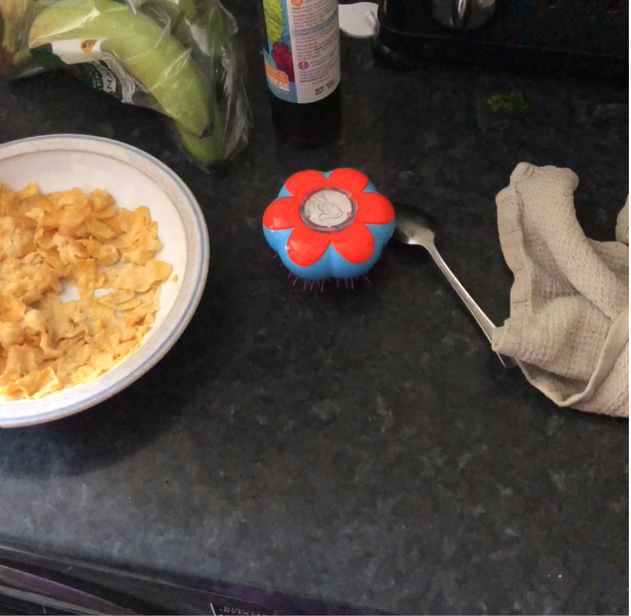
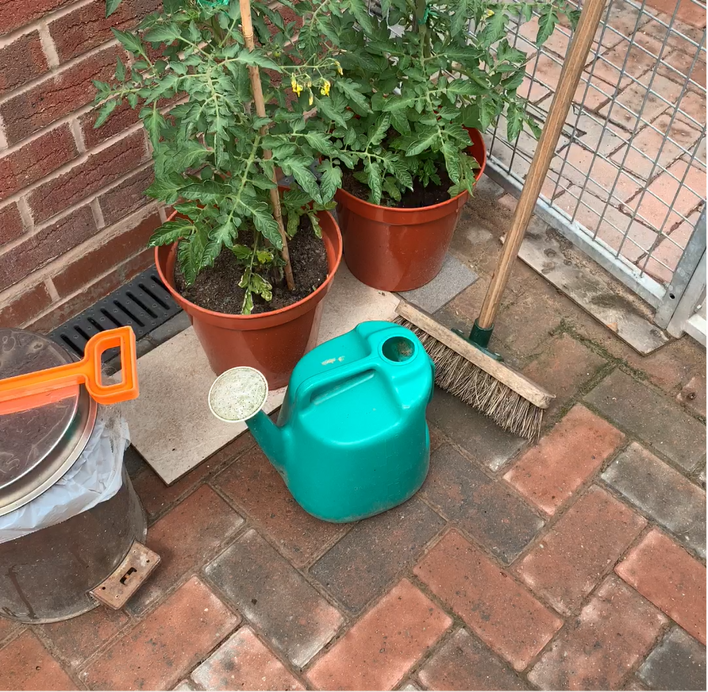

# ORBIT: A Real-World Few-Shot Dataset for Teachable Object Recognition

This repository contains code for the following two papers:
- [ORBIT: A Real-World Few-Shot Dataset for Teachable Object Recognition](https://arxiv.org/abs/2104.03841). Code is provided to download and prepare the ORBIT benchmark dataset, and train/test 4 few-shot learning models on this dataset (at 84x84 frames).
- [Memory Efficient Meta-Learning with Large Images](https://arxiv.org/abs/2107.01105). Code is provided for Large Image and Task Episodic (LITE) training, enabling the models to be trained on large (224x224) frames on a single GPU.

The code is authored by Daniela Massiceti and built using PyTorch 1.13.1, TorchVision 0.14.1, and Python 3.7.

<table>
  <tr>
    <td></td>
    <td></td>
    <td></td>
    <td></td>
   </tr>
   <tr>
      <td></td>
      <td></td>
      <td></td>
      <td></td>
   </tr>
   <caption style="caption-side:bottom"> <i>Frames from clean (top row) and clutter (bottom row) videos from the ORBIT benchmark dataset</i></caption>
</table>

# Installation

1. Clone or download this repository
2. Install dependencies
   ```
   cd ORBIT-Dataset

   # if using Anaconda
   conda env create -f environment.yml
   conda activate orbit-dataset

   # if using pip
   pip install -r requirements.txt
   ```

# Download ORBIT Benchmark Dataset


The following script downloads the benchmark dataset into a folder called `orbit_benchmark_<FRAME_SIZE>` at the path `folder/to/save/dataset`. Use `FRAME_SIZE=224` to download the dataset already re-sized to 224x224 frames. For other values of `FRAME_SIZE`, the script will dynamically re-size the frames accordingly:
```
bash scripts/download_benchmark_dataset.sh folder/to/save/dataset FRAME_SIZE
```

Alternatively, the 224x224 train/validation/test ZIPs can be manually downloaded [here](https://city.figshare.com/articles/dataset/_/14294597). Each should be unzipped as a separate train/validation/test folder into `folder/to/save/dataset/orbit_benchmark_224`. The full-size (1080x1080) ZIPs can also be manually downloaded and `scripts/resize_videos.py` can be used to re-size the frames if needed.

The following script summarizes the dataset statistics:
```
python3 scripts/summarize_dataset.py --data_path path/to/save/dataset/orbit_benchmark_<FRAME_SIZE>
# to aggregate stats across train, validation, and test collectors, add --combine_modes
```
These should match the values in Table 2 (`combine_modes=True`) and Table A.2 (`combine_modes=False`) in the dataset paper.

# Training & testing models on ORBIT

The following describes the protocols for training and testing models on the ORBIT Benchmark.

## Training protocol

The training protocol is flexible and can leverage any training regime (e.g. episodic learning, self-supervised learning). There are no restrictions on the choice of model/feature extractor, or how users/objects/videos/frames are sampled.

**What data can be used**:
* All data belonging to the ORBIT train users. This includes their clean and clutter videos, the videos' object labels, and any extra frame annotations (e.g. bounding boxes and quality issues).
* Any other dataset, including for pre-training the feature extractor.

**What data cannot be used**:
* All data belonging to the ORBIT validation and test users (including videos, video labels and frame annotations).


## Testing protocol (updated Dec 2022)

We have updated the evaluation protocol for the ORBIT benchmark (compared to the original [dataset paper](https://arxiv.org/pdf/2104.03841.pdf])) following the [ORBIT Few-Shot Object Recognition Challenge 2022](https://eval.ai/web/challenges/challenge-page/1438/overview):

* We have increased the number of tasks that should be sampled per test user from 5 to 50. As before, the 'way' for each task should include **all** the user's objects. The (meta-trained) model must be personalized to these objects using only the task's support set (sampled from the user's labelled clean videos), and then evaluated on the task's query set (sampled from the user's clutter videos) videos. This corresponds to the 'Clutter Video Evaluation (CLU-VE)' setting in the original dataset paper.
* We have reduced the number of frames that should be sampled in a task's query set: rather than **all** the frames from **all** the user's clutter videos, the query set should contain 200 randomly sampled frames per video for **all** the user's clutter videos.
  * For each clutter video, the personalized model should predict the object in each of its 200 randomly sampled frames, and the **frame accuracy** metric should be computed (i.e. over the 200 frames).
  * Note, before sampling the 200 frames, the video should be filtered to exclude all frames that do not contain the ground-truth object (i.e. `object_not_present_issue=True`; see [Filtering by annotations](https://github.com/microsoft/ORBIT-Dataset#filtering-by-annotations) section). If after filtering, a clutter video has less than 50 valid frames, the video should be excluded from the evaluation. If it has 50-200 valid frames then all these frames should be included.
  * The above should be repeated for each clutter video in the task's query set, resulting in N frame accurary scores where N is the number of clutter videos belonging to the user. Note, since predictions are not made for all frames in a clutter video, we no longer ask the frames-to-recognition and video accuracy metrics to be reported.
  * The above should be repeated for each of the 50 tasks sampled for each of the 17 ORBIT test users, with the frame accuracy for each 200-frame sample per clutter video flattened into one list. The average frame accuracy and 95% confidence interval should be reported over all 200-frame samples.

### **Personalize rules**
For each test user's task, a model must be personalized to **all** the user's objects using only the support (clean) videos and associated labels for those objects. Note, any method of personalization can be used (e.g. fine-tuning, parameter generation, metric learning).

**What data can be used to personalize**:
* The user's clean videos and video labels for all their objects. Frames can be sampled from these videos in any way and pre-processed/augmented freely. We empirically found that uniformly sampling frames from the clean videos when personalizing yields better performance than other sampling methods, hence all our baselines use this sampling method.

**What data cannot be used to personalize**:
* Extra annotations for the user's clean videos (e.g. bounding boxes, quality issues).
* The user's clutter videos (including video labels and extra annotations).
* Data belonging to other ORBIT users (including videos, video labels, and extra annotations).
* Other datasets.

### **Recognize rules**
Once a model has been personalized to a test user's task, the model should be evaluated on the task's query set which should contain **all** that user's clutter videos. Predictions should be made for 200 randomly sampled frames per clutter video, ensuring that no sampled frames have `object_not_present_issue=True`. For each frame, the personalized model should predict which _one_ object is present from **all** the user's objects. The frame accuracy metric should be calculated over the 200 randomly sampled frames for each clutter video in the task's query set.

Note, before sampling the 200 frames, the video should be filtered to exclude all frames that do not contain the ground-truth object (i.e. `object_not_present_issue=True`; see [Filtering by annotations](https://github.com/microsoft/ORBIT-Dataset#filtering-by-annotations) section). If after filtering, a clutter video has less than 50 valid frames, the video should be excluded from the evaluation. If it has 50-200 valid frames then all these frames should be included.

**What data can be used to make a frame prediction**:
* The current frame and any frames before it in the clutter video.

**What data cannot be used to make a frame prediction**:
* Frames _after_ the current frame in the clutter video.
* Frames from other clutter videos (belonging to the current or other ORBIT users).
* Video labels and extra annotations (e.g. bounding boxes, quality issue labels) for the current or previous frames.

# Baselines

The following scripts can be used to train and test several baselines on the ORBIT benchmark. We provide support for 224x224 frames and the following feature extractors: `efficientnet_b0` (pre-trained on ImageNet-1K), `efficientnet_v2_s`, `vit_s_32`, and `vit_b_32` (all pre-trained on ImagetNet-21K), and `vit_b_32_clip` (pre-trained on Laion2B).

All other arguments are described in `utils/args.py`. Note that the Clutter Video Evaluation (CLU-VE) setting is run by specifying `--context_video_type clean --target_video_type clutter`. Experiments will be saved in `--checkpoint_dir`. All other implementation details are described in Section 5 and Appendix F of the [dataset paper](https://arxiv.org/abs/2104.03841).

Note, before training/testing remember to activate the conda environment (`conda activate orbit-dataset`) or virtual environment. If you are using Windows (or WSL) you may need to set `workers=0` in `data/queues.py` as multi-threaded data loading is not supported. You will also need to [enable longer file paths](https://docs.microsoft.com/en-us/windows/win32/fileio/maximum-file-path-limitation#enable-long-paths-in-windows-10-version-1607-and-later) as some file names in the dataset are longer than the system limit.

**CNAPS+LITE.**
Our implementation of the model-based few-shot learner [CNAPs](https://arxiv.org/abs/1906.07697) (Requeima et al., _NeurIPS 2019_) is trained with LITE on a Tesla V100 32GB GPU (see [Table 1](https://arxiv.org/pdf/2107.01105.pdf)):
```
python3 single-step-learner.py --data_path folder/to/save/dataset/orbit_benchmark_224 \
                         --feature_extractor efficientnet_b0 \
                         --classifier versa --adapt_features \
                         --context_video_type clean --target_video_type clutter \
                         --with_lite --num_lite_samples 16 --batch_size 256 \
```

**Simple CNAPs+LITE.**
Our implementation of the model-based few-shot learner [Simple CNAPs](https://arxiv.org/abs/1912.03432) (Bateni et al., _CVPR 2020_) is trained with LITE on a Tesla V100 32GB GPU (see [Table 1](https://arxiv.org/pdf/2107.01105.pdf)):
```
python3 single-step-learner.py --data_path folder/to/save/dataset/orbit_benchmark_224 \
                         --feature_extractor efficientnet_b0 \
                         --classifier mahalanobis --adapt_features \
                         --context_video_type clean --target_video_type clutter \
                         --with_lite --num_lite_samples 16 --batch_size 256 \
```

**ProtoNets+LITE.**
Our implementation of the metric-based few-shot learner [ProtoNets](https://arxiv.org/abs/1703.05175) (Snell et al., _NeurIPS 2017_) is trained with LITE on a Tesla V100 32GB GPU (see [Table 1](https://arxiv.org/pdf/2107.01105.pdf)):
```
python3 single-step-learner.py --data_path folder/to/save/dataset/orbit_benchmark_224 \
                               --feature_extractor efficientnet_b0 \
                               --classifier proto --learn_extractor \
                               --context_video_type clean --target_video_type clutter \
                               --with_lite --num_lite_samples 16 --batch_size 256
```

**FineTuner.**
Given the recent strong performance of finetuning-based few-shot learners, we also provide a finetuning baseline. Here, we simply freeze a pre-trained feature extractor and, using a task's support set, we finetune either i) a linear head, or i) a linear head _and_ FiLM layers ([Perez et al., 2017](https://arxiv.org/abs/1709.07871)) in the feature extractor (see [Table 1](https://arxiv.org/pdf/2107.01105.pdf)). In principle, you could also use a meta-trained checkpoint as an initialization through the `--model_path` argument.

```
python3 multi-step-learner.py --data_path folder/to/save/dataset/orbit_benchmark_224 \
                            --feature_extractor efficientnet_b0 \
                            --mode test \ # train_test not supported
                            --classifier linear \
                            --context_video_type clean --target_video_type clutter \
                            --personalize_num_grad_steps 50 --personalize_learning_rate 0.001 --personalize_optimizer adam \
                            --batch_size 1024
```
Note, we have removed support for further training the feature extractor on the ORBIT train users using standard supervised learning with the objects' broader cluster labels. Please roll back to [this commit](https://github.com/microsoft/ORBIT-Dataset/commit/5a2b4e852d610528403f12a5130f676e5c6e48bc) if you would like to do this. The object clusters can be found in `data/orbit_{train,validation,test}_object_clusters_labels.json` and `data/object_clusters_benchmark.txt`.

**MAML.**
Our implementation of [MAML](https://arxiv.org/abs/1703.03400) (Finn et al., _ICML 2017_) is no longer supported. Please roll back to [this commit](https://github.com/microsoft/ORBIT-Dataset/commit/5a2b4e852d610528403f12a5130f676e5c6e48bc) if you need to reproduce the MAML baselines in [Table 5](https://arxiv.org/pdf/2104.03841.pdf]) (dataset paper) or [Table 1](https://arxiv.org/pdf/2107.01105.pdf) (LITE paper).

**84x84 images.**
Training/testing on 84x84 images is no longer supported. Please roll back to [this commit](https://github.com/microsoft/ORBIT-Dataset/commit/5a2b4e852d610528403f12a5130f676e5c6e48bc) if you need to reproduce the original baselines in [Table 5](https://arxiv.org/pdf/2104.03841.pdf]) (dataset paper).

# GPU and CPU memory requirements

The GPU memory requirements can be reduced by:
* Using a smaller feature extractor (e.g. `efficientnet_b0`).
* Training with LITE (only relevant for Simple CNAPs/CNAPs/ProtoNets and typically only needed for 224x224 or larger images). This can be activated with the `--with_lite` flag. Memory can be further saved by lowering `--num_lite_samples`.
* Using a smaller `batch_size`. This is relevant for all baselines (trained with/without LITE).
* Lowering the `--clip_length` argument.
* Changing the `--train_context_clip_method`, `--train_target_clip_method`, or `--test_context_clip_method` arguments to `random`/`random_200`/`uniform` rather than `max`.

The CPU memory requirements can be reduced by:
* Lowering the number of data loader workers (see `num_workers` in `data/queues.py`).

# Pre-trained checkpoints

The following checkpoints have been trained on the ORBIT train users using the arguments specified above. The models can be run in test-only mode using the same arguments as above except adding `--mode test` and providing the path to the checkpoint as `--model_path path/to/checkpoint.pt`. In principle, the memory required for testing should be significantly less than training so should be possible on 1x 12-16GB GPU (or CPU with ``--gpu -1``). The ``--batch_size`` flag can be used to further reduce memory requirements.

|   Model   | Frame size | Feature extractor |  Trained with LITE | Frame Accuracy (95% c.i) | Trained with clean/clutter (context/target) videos |
|:---------:|:----------:|:-----------------:|:------------------:|:-------------------:|:------------------:|
|   CNAPs        |     224    |  EfficientNet-B0  |         Y          | 67.68 (0.58) | [`orbit_cluve_cnaps_efficientnet_b0_224_lite.pth`](https://taixmachinelearning.z5.web.core.windows.net/orbit_cluve_cnaps_efficientnet_b0_224_lite.pth)
|           |     224    |  ViT-B-32-CLIP |         Y          | 72.33 (0.54) | [`orbit_cluve_cnaps_vit_b_32_clip_224_lite.pth`](https://taixmachinelearning.z5.web.core.windows.net/orbit_cluve_cnaps_vit_b_32_clip_224_lite.pth)
|   SimpleCNAPs  |     224    | EfficientNet-B0   |         Y          | 66.83 (0.60) | [`orbit_cluve_simple_cnaps_efficientnet_b0_224_lite.pth`](https://taixmachinelearning.z5.web.core.windows.net/orbit_cluve_simple_cnaps_efficientnet_b0_224_lite.pth)
|     |     224    | ViT-B-32-CLIP   |         Y          | 68.86 (0.56) | [`orbit_cluve_simple_cnaps_vit_b_32_clip_224_lite.pth`](https://taixmachinelearning.z5.web.core.windows.net/orbit_cluve_simple_cnaps_vit_b_32_clip_224_lite.pth)
| ProtoNets |     224    |  EfficientNet-B0  |         Y          | 67.91 (0.56) |[`orbit_cluve_protonets_efficientnet_b0_224_lite.pth`](https://taixmachinelearning.z5.web.core.windows.net/orbit_cluve_protonets_efficientnet_b0_224_lite.pth)
|  |     224    |  EfficientNet-V2-S  |         Y          | 72.76 (0.53) |[`orbit_cluve_protonets_efficientnet_v2_s_224_lite.pth`](https://taixmachinelearning.z5.web.core.windows.net/orbit_cluve_protonets_efficientnet_v2_s_224_lite.pth)
|  |     224    |  ViT-B-32  |         Y          | 73.53 (0.51) |[`orbit_cluve_protonets_vit_b_32_224_lite.pth`](https://taixmachinelearning.z5.web.core.windows.net/orbit_cluve_protonets_vit_b_32_224_lite.pth)
|  |     224    |  ViT-B-32-CLIP  |         Y          |  73.95 (0.52) |[`orbit_cluve_protonets_vit_b_32_clip_224_lite.pth`](https://taixmachinelearning.z5.web.core.windows.net/orbit_cluve_protonets_vit_b_32_clip_224_lite.pth)
| ProtoNets (cosine) |     224    |  EfficientNet-B0  |         Y          | 67.48 (0.57) |[`orbit_cluve_protonets_cosine_efficientnet_b0_224_lite.pth`](https://taixmachinelearning.z5.web.core.windows.net/orbit_cluve_protonets_cosine_efficientnet_b0_224_lite.pth)
|           |     224    |  EfficientNet-V2-S  |         Y          | 73.10 (0.54) |[`orbit_cluve_protonets_cosine_efficientnet_v2_s_224_lite.pth`](https://taixmachinelearning.z5.web.core.windows.net/orbit_cluve_protonets_cosine_efficientnet_v2_s_224_lite.pth)
|           |     224    |  ViT-B-32  |         Y          | 75.38 (0.51) |[`orbit_cluve_protonets_cosine_vit_b_32_224_lite.pth`](https://taixmachinelearning.z5.web.core.windows.net/orbit_cluve_protonets_cosine_vit_b_32_224_lite.pth)
|           |     224    |  ViT-B-32-CLIP  |         Y          | 73.54 (0.52) |[`orbit_cluve_protonets_cosine_vit_b_32_clip_224_lite.pth`](https://taixmachinelearning.z5.web.core.windows.net/orbit_cluve_protonets_cosine_vit_b_32_clip_224_lite.pth)
| FineTuner |     224    |  EfficientNet-B0  |         N           | 64.57 (0.56) | Used pre-trained extractor
|           |     224    |  ViT-B-32-CLIP  |         N           | 71.31 (0.55) | Used pre-trained extractor
| FineTuner + FiLM |     224    |  EfficientNet-B0  |         N       | 66.63 (0.58) | Used pre-trained extractor
|  |     224    |  ViT-B-32-CLIP  |         N           | 71.86 (0.55) | Used pre-trained extractor

# ORBIT Few-Shot Object Recognition Challenge

The [VizWiz workshop](https://vizwiz.org/workshops/2024-vizwiz-grand-challenge-workshop) is hosting the ORBIT Few-Shot Object Recognition Challenge at [CVPR 2024](https://cvpr.thecvf.com). The Challenge will run from Friday 12 January 2024 9am CT to Friday 3 May 2023 9am CT.

To participate, visit the [Challenge evaluation server](https://eval.ai/web/challenges/challenge-page/2186/overview) which is hosted on EvalAI. Here you will find all details about the Challenge, including the competition rules and how to register your team. The winning team will be invited to give an in-person or virtual talk at the VizWiz workshop at CVPR 2024. Further prizes are still being confirmed.

We have provided [orbit_challenge_getting_started.ipynb](https://github.com/microsoft/ORBIT-Dataset/blob/master/orbit_challenge_getting_started.ipynb) to help get you started. This starter task will step you through how to load the ORBIT validation set, run it through a pre-trained model, and save the results which you can then upload to the evaluation server.

For any questions, please email orbit-challenge@microsoft.com.

# Extra annotations

We provide additional annotations for the ORBIT benchmark dataset in [`data/orbit_extra_annotations.zip`](https://github.com/microsoft/ORBIT-Dataset/raw/master/data/orbit_extra_annotations.zip). The annotations include per-frame bounding boxes for all clutter videos, and per-frame quality issues for all clean videos. Please read below for further details.

* The annotations are saved in train/validation/test folders following the benchmark splits. These should be saved in an `annotations` folder in the root dataset directory (e.g. `path/to/orbit_benchmark_224/annotations/{train,validation,test}`).
* In each train/validation/test folder, there is one JSON per video (e.g. `P177--bag--clutter--Zj_1HvmNWejSbmYf_m4YzxHhSUUl-ckBtQ-GSThX_4E.json`) which contains keys that correspond to all frames in that video (e.g. `{"P177--bag--clutter--Zj_1HvmNWejSbmYf_m4YzxHhSUUl-ckBtQ-GSThX_4E-00001.jpg": {frame annotations}, "P177--bag--clutter--Zj_1HvmNWejSbmYf_m4YzxHhSUUl-ckBtQ-GSThX_4E-00002.jpg": {frame annotations}, ...}`.
* Depending on the video type, a frame's annotation dictionary will contain either bounding box *or* quality issue annotations. The only annotation common to both video types is an `object_not_present_issue`.

## Bounding boxes
We provide per-frame bounding boxes for all clutter videos. Note, there is _one_ bounding box per frame (i.e. the location of the labelled/target object). Other details:

* Bounding boxes are saved in the format `{"P177--bag--clutter--Zj_1HvmNWejSbmYf_m4YzxHhSUUl-ckBtQ-GSThX_4E-00001.jpg": {"object_bounding_box": {"x": int, "y": int, "w": int, "h": int}, "object_not_present_issue": false}, ...}` where `(0,0)` is the top left corner of the bounding box. The coordinates are given for the original 1080x1080 frames, thus `x` and `y` range from `[0,1079]`, and `width` and `height` from `[1,1080]`.
* When the labelled/target object is not in the frame, the annotations are given as `{"object_bounding_box": null, "object_not_present_issue": true}`.

## Quality issues (annotated by [Enlabeler (Pty) Ltd](https://enlabeler.com/))
We provide per-frame quality issues for all clean videos. Note, a frame can contain any/multiple of the following 7 issues: `object_not_present_issue`, `framing_issue`, `viewpoint_issue`, `blur_issue`, `occlusion_issue`, `overexposed_issue`, `underexposed_issue`. The choice of issues was informed by [Chiu et al., 2020](https://arxiv.org/abs/2003.12511). Other details:

* Quality issues are saved in the format `{"P177--bag--clean--035eFoVeNqX_d86Vb5rpcNwmk6wIWA0_3ndlrwI6OZU-00001.jpg": {"object_not_present_issue": false, "framing_issue": true, "viewpoint_issue": true, "blur_issue": false, "occlusion_issue": false, "overexposed_issue": false, "underexposed_issue": false}, ...}`.
* When the labelled/target object is not in frame, the annotations are given as `{"object_not_present_issue": true, "framing_issue": null, "viewpoint_issue": null, "blur_issue": null, "occlusion_issue": null, "overexposed_issue": null, "underexposed_issue": null}`.
* A 'perfect' frame (i.e. a frame with no quality issues) would have all 7 issue types set to false.

## Loading the annotations
You can use `--annotations_to_load` to load the bounding box and quality issue annotations. The argument can take any/multiple of the following: `object_bounding_box`, `object_not_present_issue`, `framing_issue`, `viewpoint_issue`, `blur_issue`, `occlusion_issue`, `overexposed_issue`, `underexposed_issue`. The specified annotations will be loaded and returned in a dictionary with the task data (note, if a frame does not have one of the specified annotations then `nan` will appear in its place). At present, the code does not use these annotations for training/testing. To do so, you will need to return them in the `unpack_task` function in `utils/data.py`.

## Filtering by annotations

If you would like to filter tasks' context or target sets by specific quality annotations (e.g. remove all frames with no object present), you can use `--train_filter_context`/`--tain_filter_target` to filter train tasks, or `--test_filter_context`/`--test_filter_target` to filter validation/test tasks. These arguments accept the same options as above. The filtering is applied to all context/target videos when the data loader is created (see `load_all_users` in `data/dataset.py`).

# Download unfiltered ORBIT dataset

Some collectors/objects/videos did not meet the minimum requirement to be included in the ORBIT benchmark dataset. The full unfiltered ORBIT dataset of 4733 videos (frame size: 1080x1080) of 588 objects can be downloaded and saved to `folder/to/save/dataset/orbit_unfiltered` by running the following script
```
bash scripts/download_unfiltered_dataset.sh folder/to/save/dataset
```
Alternatively, the train/validation/test/other ZIPs can be manually downloaded [here](https://city.figshare.com/articles/dataset/_/14294597). Use `scripts/merge_and_split_benchmark_users.py` to merge the other folder (see script for usage details).

To summarize and plot the unfiltered dataset, use `scripts/summarize_dataset.py` (with `--no_modes` rather than `--combine_modes`) similar to above.

# Citations

### For models trained with LITE:
```
@article{bronskill2021lite,
  title={{Memory Efficient Meta-Learning with Large Images}},
  author={Bronskill, John and Massiceti, Daniela and Patacchiola, Massimiliano and Hofmann, Katja and Nowozin, Sebastian and Turner, Richard E.},
  journal={Proceedings of the 35th Conference on Neural Information Processing Systems (NeurIPS)},
  year={2021}}
```
### For ORBIT dataset and baselines:
```
@inproceedings{massiceti2021orbit,
  title={{ORBIT: A Real-World Few-Shot Dataset for Teachable Object Recognition}},
  author={Massiceti, Daniela and Zintgraf, Luisa and Bronskill, John and Theodorou, Lida and Harris, Matthew Tobias and Cutrell, Edward and Morrison, Cecily and Hofmann, Katja and Stumpf, Simone},
  booktitle={Proceedings of the IEEE/CVF International Conference on Computer Vision (ICCV)},
  year={2021}}
```

# Contact

To ask questions or report issues, please open an issue on the Issues tab.

# Contributing

This project welcomes contributions and suggestions.  Most contributions require you to agree to a
Contributor License Agreement (CLA) declaring that you have the right to, and actually do, grant us
the rights to use your contribution. For details, visit https://cla.opensource.microsoft.com.

When you submit a pull request, a CLA bot will automatically determine whether you need to provide
a CLA and decorate the PR appropriately (e.g., status check, comment). Simply follow the instructions
provided by the bot. You will only need to do this once across all repos using our CLA.

This project has adopted the [Microsoft Open Source Code of Conduct](https://opensource.microsoft.com/codeofconduct/).
For more information see the [Code of Conduct FAQ](https://opensource.microsoft.com/codeofconduct/faq/) or
contact [opencode@microsoft.com](mailto:opencode@microsoft.com) with any additional questions or comments.
